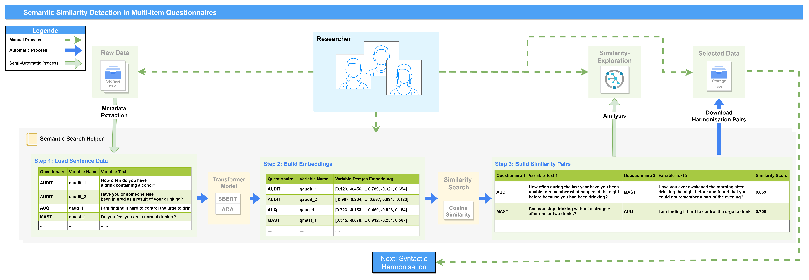
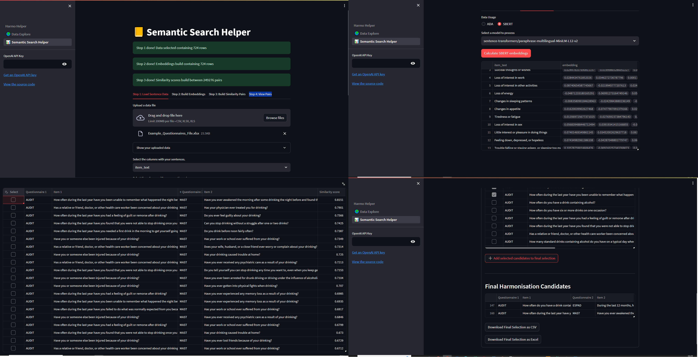

# Semantic Similarity Detection in Multi-Item Questionnaires with HarmoHelper

The "SemHarmoHelper" repository features an application that helps in the detection of semantic similarity within multi-item questionnaires, aimed at facilitating the data harmonization process. It provides a workflow overview, UI overview, script features, and an about section describing its functionalities, such as data import, environment setup, Streamlit integration, data upload functionality, sentence embedding, similarity calculation, and more. 
The app utilizes Python libraries for data analysis and Streamlit for web app development, making it a valuable tool for researchers and data analysts. For a detailed overview and to explore the app's capabilities, read the [publication]().

## Workflow Overview


The application is a first prototype for the semantic similarity detection within multi-item questionnaires. In order use the tool you need a list of questionnaires and the corresponding questions.
Workflow for detecting semantic similarities within multi-item questionnaires. The workflow initiates with the compilation of raw data, followed by the extraction of metadata. 
The 'Semantic Search Helper' loading the data for further processing. Step 1 involves the metadata input of sentence data from questionnaires, including variable names and text. 
In Step 2, embeddings are generated using transformer models such as SBERT and ADA to convert the text into numerical representations. 
The third step focuses on building similarity pairs, where text from different questionnaires is compared for semantic similarities, producing similarity scores. 
Researchers can then download these harmonization pairs for further analysis. The color-coding in the legend indicates manual, automatic, and semi-automatic processes throughout the workflow 

## UI Overview


The "Semantic Search Helper" application interface. The user interface is divided into four quadrants, each representing different phases of the harmonisation process: Data upload and selection, embedding calculation, evaluation of semantic similarity between questionnaire items and the final selection of harmonisation candidates with the option to download the results. The interface facilitates the comparison of semantic similarities between survey questions, simplifying the data harmonisation workflow for researchers.

The code includes a Streamlit-based web app developed for analyzing text data using embeddings and similarity calculations. The app allows users to upload data, filter it, and identify relevant text pairs based on their similarity. This can speed up and facilitate the first step in data harmonization.

The application was conceived and provided in the context of the publication ()

script features integration with various Python libraries and APIs to perform data preprocessing and analysis tasks. Here's a brief description of its functionalities:

1. **Data Import and Environment Setup**: The script imports necessary libraries like `numpy`, `pandas`, `streamlit`, `matplotlib`, and others for data manipulation, visualization, and web app development. It also includes `openai` and `openpyxl` for AI-based text processing and Excel file handling.

2. **Streamlit Integration**: The use of `streamlit` suggests that the script is meant to run as a web application, allowing for interactive data input and visualization.

3. **Data Upload Functionality**: A function `get_data()` is implemented to upload data files (CSV, XLSX) through a Streamlit interface, enabling users to easily input their data sets for analysis.

4. **Sentence Embedding and Similarity Calculation**: The script employs `SentenceTransformer` from the `sentence_transformers` library to calculate embeddings of textual data, which are then used to compute cosine similarity scores. This is crucial for analyzing and comparing text-based data, such as questionnaire responses.

5. **Data Processing and Harmonization**: Functions like `get_similarity_dataframe()` and `calculate_embeddings()` suggest that the script processes the data to find similarities between different datasets, a key step in data harmonization.

6. **Interactive Data Selection and Filtering**: The script seems to provide an interactive interface for selecting and filtering data based on user inputs, potentially through Streamlit widgets.

7. **Exporting Data**: Functions are provided to convert data frames to CSV or Excel formats, allowing users to download the processed data.

8. **API Key Integration for OpenAI**: The script includes functionality for users to input their OpenAI API key, indicating the use of OpenAI's services, possibly for advanced text processing or analysis.

9. **Embedding and Similarity Tabs**: The script includes tabs for loading data, building embeddings, creating similarity pairs, and viewing these pairs, indicating a step-by-step process for users to follow in the web application.

Overall, this script seems ideal for researchers and data analysts looking to harmonize and analyze text-based data, especially from multiple sources or studies. The integration with machine learning models for text similarity and the user-friendly Streamlit interface makes it a powerful tool for complex data harmonization tasks.

Sure, I'll provide the installation and running instructions in English, formatted in Markdown:

---

## Installation and Running Instructions

To start the application, you need to ensure Docker is installed on your system as the application is run within a Docker container. Follow these steps to install and run the application:


### Prerequisites:
- Ensure Docker is installed on your system. If not, download and install Docker from the [official Docker website](https://docs.docker.com/get-docker/).

### Steps:

1. **Download Application Code:**
   Download the application code (including the `Dockerfile` and `requirements.txt`) to a directory of your choice.

2. **Build Docker Image:**
   Open a command line or terminal and navigate to the directory containing the `Dockerfile`. Execute the following command to build the Docker image:
   ```bash
   docker build -t harmo-app .
   ```

3. **Run Docker Container:**
   After successfully building the image, start the container with the following command. This command runs the Streamlit application inside the Docker container and makes it accessible on port 8501 of your host system:
   ```bash
   docker run -p 8501:8501 harmo-app
   ```

4. **Access Application in Browser:**
   Open a web browser of your choice and navigate to the following URL to access the Streamlit application:
   ```
   http://localhost:8501
   ```

### Notes:

- The command `docker build -t harmo-app .` reads the `Dockerfile` in the current directory (`.`) and builds a Docker image based on the instructions defined within it.
- The `docker run` command starts a container based on the created image. The parameter `-p 8501:8501` forwards port 8501 of the container to port 8501 of your host system, allowing you to access the Streamlit application through your browser.
- If you make changes to the application code, you will need to rebuild the Docker image to incorporate the changes.

By following these steps, you can locally install and run the "Semantic Similarity Detection in Multi-Item Questionnaires with HarmoHelper" application on your computer.

---